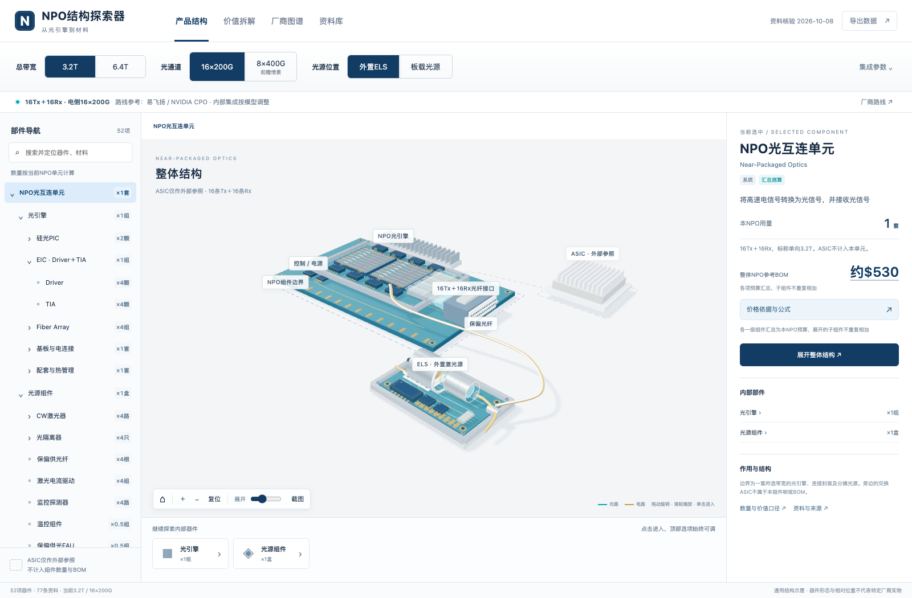

# NPO结构探索器

本地可打开的交互式HTML，用于查看NPO组件结构、通道数量、BOM参考情景和厂商资料。资料核验截至2026-10-08；2026-10-09更新计价模型与说明，未新增资料核验。



## 打开与分享

**[在线打开NPO结构探索器](https://anthonyhanxiangding-lab.github.io/npo-structure-explorer/)** · [GitHub仓库](https://github.com/anthonyhanxiangding-lab/npo-structure-explorer)

直接打开`NPO结构探索器.html`或`index.html`。模型、代码、样式、资料全部内嵌，不依赖网络或CDN；外部来源链接在点击时联网。3D视图需要支持WebGL的现代浏览器及硬件加速。手机也可浏览。

下载仓库ZIP并解压后，直接打开`index.html`即可使用，不需要安装开发工具。源码和数据库用于后续维护，网页本身已包含运行所需内容。

如需托管，GitHub Pages可从`main`分支根目录发布`index.html`，`.nojekyll`用于跳过Jekyll处理。每次更新后需重新构建并提交生成的HTML。

## 主要操作

- 顶部随时切换3.2T/6.4T、光通道组合和光源位置，不离开当前器件
- 左侧器件树显示当前配置用量；FAU组数与纤芯根数分别计算
- 单击模型、模型标签或器件树，直接进入对应部件视图并显示详情
- 搜索中文名称、英文名称或别名后自动定位；按Enter立即定位，中文输入法选词期间不跳转
- 搜索支持中英文全称、常用缩写、近义词、英美拼写、大小写、全角字符、标点分隔和多词换序。辅助别名只用于检索，组件树和详情保持原名称；EIC组显示为“EIC · Driver＋TIA”
- 拖动旋转、滚轮缩放、展开滑杆分离内部零件；面包屑、返回按钮及Esc返回上级
- 集成参数可调整Driver/TIA每颗通道数、PIC集成度、FAU容量、CW扇出、隔离器旋片数量与可选元件
- 切换Tx发射、Rx接收、CW供光路径，分别查看信号方向；监测PD与温控是供光反馈和热管理支路
- 价值拆解支持预算拆分与成本测算两种模式，均为工程参考情景；厂商图谱和资料库可搜索
- 每个已配置部件显示合计价值、等效单价及占直接上一级组件的比例；点击金额或“价格依据与公式”可查看代入当前数字的计算过程、假设、来源链接，并逐层回看上级预算
- 本层价值构成逐项列出子件与未拆分余额；余额不代表已核实的具体成本项
- 补充单价假设绑定器件规格；不匹配时暂停使用，切回匹配规格后恢复。记录仅保存在本机浏览器，不改原始数据库
- 固定当前配置后，可与调整后的配置比较数量、供光分摊及单价假设的影响；导出数据包含当前会话假设与固定配置快照，当前没有导入界面

## 范围与口径

ASIC只是旁边的外部参照，不属于可选组件树，不计入数量或BOM。本NPO范围为一套标称单向带宽的光引擎及分摊光源，排除交换ASIC、系统主板、机箱及系统冷却。

默认3.2T为16条200G Tx与16条200G Rx；6.4T为32条200G Tx与32条200G Rx。芯片封装数与功能通道数分开，PIC集成度和FAU容量为可调结构假设。

400G光lane的两个选项均为前瞻研究情景。本应用选择电接口同步升级400G，不把200G电接口的2:1 gearbox路线混入。OIF 3.2T旧规范的8×400G是端口组合，不能当作8条400G光lane。

信号FAU采用Tx与Rx分体、并行单波长链路。信号纤根数为Tx+Rx，不含保偏供光纤。FAU组件数按每组容量分别向上取整。WDM、共用Tx/Rx阵列或多芯封装属于其他结构，当前数量不能直接套用。

CW需求按光通道/扇出向上取整，再按8路CW参考光源盒分配预算。它只是结构假设，还必须符合真实功率、分光及链路损耗要求。外置模式的模型盒数为`ceil(CW路数/8)`，分摊等效套数为`CW路数/8`；未用通道能否共享仍需实际系统确认。板载光源是位置情景，沿用等效光源份额，未假设封装节省。

组件树同时包含实物总成、功能通道、集成功能、材料核算份数与预算分类。EIC是Driver与TIA的预算组，PIC内部功能也不等于独立采购器件。温控、保偏供光FAU、光源整形与温控电路的用量按光源份额分摊，实物数量尚未确认，0.5组不表示半个器件。监测PD与温控在图中归入CW封装或热路径附近，预算仍归光源组件；这一示意未确认通用封装关系。

## 价格边界

基准来自已归档并重新阅读的微信公众号文章《新参者手记｜光通信入门：从华为超节点看NPO发展》，2026-09-27。它是独立作者的产业交流/测算，未提供底层报价，不是已审计成本或特定客户成交价。

对应3.2T 32×100G参考模型：光引擎材料约$500，完整ELS约$300，按两引擎分摊后每NPO约$650。PIC原文为$150+，CW原文为$160+；使用约数作可视化预算，不将其写成精确报价。

**两种计价模式都未取得同规格采购报价，不能据此判断400G路线比200G路线更便宜**。模型未计400G溢价、良率、功耗及具体装配条件，参数变化只解释结构和假设的影响。

| 模式 | 如何计算 | 数量或单价变化的含义 |
| --- | --- | --- |
| 预算拆分，默认 | PIC、基板及其他引擎预算按带宽缩放；Driver＋TIA与信号FAU按通道数量缩放；光源按占用份额分摊。内部子件在父级预算中分配 | 子件单价会占用父级预算并重新分配同级余额。增加旋片数等操作可能只降低等效单价，不证明实际成本下降 |
| 成本测算 | 从固定3.2T、16×200G参考配置反算工程等效单价和未拆分余额单价，按当前数量逐层汇总 | 数量变化直接影响成本，同级独立子件单价保持不变；跨速率和集成度沿用参考单价属于受控假设 |

成本模式的固定参考配置为每颗Driver/TIA 4通道、每颗PIC 8路双向通道、FAU 8芯、CW扇出4及每只隔离器1片旋片。它以预算反算值提供可比较的数量影响，没有把工程参考单价改写为供应商报价。启用可选中介层时，参考成本另外计入；默认基准中未拆分余额仍保留，模型未识别该余额的实际组成。

预算模式保留六个一级预算池。公开资料没有拆价的内部组件采用显式工程权重分配，价格标签写为“上级预算分配”。例如默认TIA占Driver＋TIA预算50%，法拉第旋片占隔离器预算40%，接收PD占PIC预算20%；这些比例是模型假设，未获同规格拆价验证。预算模式下，每组FAU容量变化不自动降低整个光纤功能预算；PIC内部功能的分配值不代表可独立采购的售价。

公司披露中的其他规格实际交易价格单独展示，禁止直接计入NPO默认BOM。例如磁光开关用法拉第小片并不等于高功率O波段NPO用旋片。真实采购ASP、器件目录价、材料BOM及成品售价不是同一分母。

父子金额已包含，不能跨层重复相加。预算模式下，用户分配超过已知父级预算时拒绝保存；切换后若造成超额，会停止展示相关比例。成本模式下，子件金额逐层更新上级；若输入组件包价，该包价形成子树计价边界，下级只在包价内拆分，超过包价的子件覆盖会被拒绝。

监测PD显示约$3/路、区间$1至5/路，明确标注为工程数量级假设。数量按每路CW一个监测点，不等于独立封装采购数量。预算模式在已有光源预算内分配；成本模式按参考单价和监测点数量计价。厂商资料支持监测PD裸片及与激光器共同封装的形态，但未验证这一价格区间；独立TO-46封装InGaAs器件约$10至18/颗的目录价另列为其他价格样本，不能直接换算为集成监测PD的量产报价。搜索“监测PD”“监控PD”“Monitor PD”或“MPD”均可定位该部件。

预算模式各层先扣除固定单价项目或本地覆盖值，再按工程权重分配剩余预算，保留未拆分余额。公式形式为“上级预算减已单列金额，乘本节点权重，除剩余总权重”；等效单价为本节点合计除当前数量；占比仅为本节点合计除直接父级合计。关闭可选节点时，其权重留在未拆分余额，不自动抬高其他部件的价格。成本模式沿用固定参考配置的余额单价，按当前数量计入上级，并单独显示。

ELS来源中的CW、光学件、温控和控制PCB均是组合口径，当前结构树使用不重叠的工程分配。例如默认CW权重136来自160减8×3的重分配假设，不能将当前净分配值当作原文CW报价；隔离器归入光学组合、控制IC归入控制PCB均属模型假设。来源中的ELS控制PCB与本结构树中光引擎基板下的PCB不是同一项。

本地单价按器件的通道速率、集成度、供光或封装选项绑定规格。纯带宽变化若只增加同规格重复器件，可继续使用该器件单价；影响其规格的参数变化会暂停覆盖并提示，原记录仍保留。每个器件目前只保存一条单价记录，重新保存会替换该记录。

固定配置比较依次替换数量与集成参数、供光与分摊参数、单价假设与计价模式，三项贡献合计等于总差额。替换顺序会影响各项归因；比较用于解释模型变化，不确认技术可行性或实际采购节省。

## 数据库与维护

- `database.json`是供网页和模型读取的完整数据快照：组件、供应商关系、架构、公开价格参考、来源、日期与价格锚点
- `database.sqlite`是同一数据的关系型副本，包含components、vendors、component_vendors、sources、architectures和metadata表
- `research/cost-suppliers.json`与`research/architecture.json`保存可维护的研究源数据，组装后内嵌到网页
- `research/cost-suppliers.json.component_metadata`维护每个节点的`budgetParent`、`physicalParent`、`quantityKind`、`quantityNote`与示意边界；预算父级不证明实物封装归属
- `research/architecture.json.parameterDefinitions`维护结构参数的可选值、来源、假设及来源适用范围；相关产品资料不验证全部参数组合。400G默认架构为电光同速，200G电侧转换路线保存在`alternativeArchitectures`中
- `historical_component_evidence.els_control_pcb`保留原ELS控制PCB约$30的作者测算与厂商证据；当前光引擎HDI/mSAP电路板没有独立价格，不沿用这条证据
- `database.json`的`valuationModel.rules`保存各层工程权重及保留余额，`research/cost-suppliers.json`的`valuation_model`保存同一默认规则；原始price、参考BOM和其他规格价格样本保留各自口径
- `research/search-aliases.json`保存每个节点的中英文辅助检索词，数据库中的`components[].aliases`用于离线搜索，重建数据库时自动合并；新增词不会替换可见名称
- `web/`为页面、数量与成本计算、程序化3D模型的源代码
- `scripts/assemble-database.mjs`把研究源数据、`web/catalog.js`与搜索别名组装为`database.json`，会覆盖直接编辑的数据快照。持久修正应先写入对应源文件

开发环境需要Node.js 20或更高版本、npm及Python 3。仅使用网页不需要这些工具。

修改研究源文件后，在仓库根目录执行：

```sh
npm ci
node scripts/assemble-database.mjs
npm run build
npm test
```

assemble组装数据，build把数据库内嵌到两份内容相同的HTML，并重新导出SQLite。仅修改`web/`界面或计算代码时无需先assemble。数据价格锚点直接驱动计算。增加组件需同时给出parent、qtyRule、quantityKind与适用结构；新qtyRule需在web/model.js中实现。新增价格需要保留currency、unit、period、scope与sourceIds，并区分来源测算、工程假设、本地输入与其他规格报价。

未建立定时检索或自动更新任务；当前显示的是截至2026-10-08的核验快照。网页不会声称所有细分器件价格实时可得。

## 核验与来源

本次覆盖52项器件节点，另有1个NPO根节点；50家厂商，77条来源。供应关系展示对应材料或器件能力，不能自动推定为特定NPO产品量产供货。

数据库保留公开来源链接、核验日期和证据范围。基础研究复用了1份高盛原表、1篇完整微信公众号文章及2份公司披露；基础版本的其他资料主要来自OIF、IPEC和厂商公开资料。本次模型更新未新增下载或核验外部资料。仓库不包含第三方研报、公司文件或微信公众号全文的再分发副本。

`npm test`检查数量与两种计价逻辑、规格绑定、中英文检索，以及3D几何和交互接口。浏览器检查覆盖离线加载、单击进入、拖动、搜索、价格依据弹窗和手机布局，可按以下步骤复现：

```sh
npm ci
npx playwright install chromium
npm run build
npm test
npm run test:browser
```

浏览器检查只打开本地生成的HTML，并拦截外部网络请求。结果保存到`qa/browser-results.json`、`qa/ui-results.json`和同目录截图；新增检查覆盖包价内深层单价、规格暂停与恢复、配置比较、参数出处及手机界面。Linux环境如缺少浏览器系统依赖，可使用`npx playwright install --with-deps chromium`安装。

通过检查后，可运行`npm run package`生成源码、数据库及浏览器QA结果的ZIP。打包会核对HTML哈希，缺少结果、检查未通过或结果对应旧HTML时会中止。`qa/`、依赖目录和生成的ZIP不提交到Git。

可用`NPO_QA_DIR`指定QA输出目录，浏览器检查和打包时须使用相同值。已有Playwright环境可通过`NPO_PLAYWRIGHT_MODULE`指定模块路径，并用`NPO_CHROMIUM_EXECUTABLE`指定浏览器可执行文件；默认使用项目依赖及其配套Chromium。

## 仓库结构

| 文件或目录 | 用途 |
| --- | --- |
| `index.html`、`NPO结构探索器.html` | 内容相同的独立离线网页，前者作为网站入口 |
| `database.json`、`database.sqlite` | 可编辑数据快照及关系型副本 |
| `web/` | 界面、3D模型、数量和价值计算、搜索源码 |
| `research/*.json` | 架构、供应商与价格依据、中英文搜索别名 |
| `scripts/` | 构建、数据导出、测试及打包脚本 |
| `docs/overview.png` | 当前网页预览 |
| `THIRD_PARTY_LICENSES.txt` | 已嵌入第三方代码的许可证 |

## 技术与授权

使用Three.js的程序化3D几何模型，不含厂商CAD、拆机照片或登录数据。模型是通用工程示意，不按真实尺寸制造。Three.js依MIT许可使用，许可证见`THIRD_PARTY_LICENSES.txt`。
